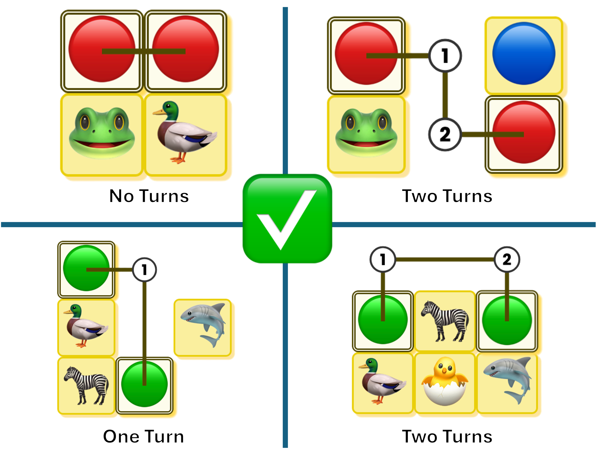
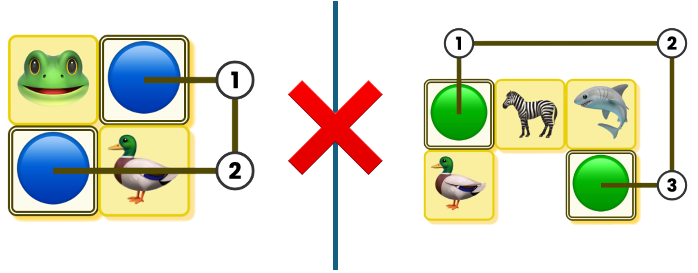

# LinkGame

A single-player or multiplayer game where the goal is to clear the board by matching pairs of
identical tiles. The tiles can only be eliminated if they can be linked by a path with no more than two 90-degrees
turns.
There are three levels in this game:

- **Easy**: Board with size `6 x 5` and `4` types of tiles
- **Medium**: Board with size `8 x 8` and `10` types of tiles
- **Hard**: Board with size `10 x 10` and `12` types of tiles

### Example of Matching Rules

Below are examples of how tiles can be correctly matched in **LinkGame**,
as well as cases where they cannot be matched:




## Prerequisites

The project is configured with **Scala 2.13.16** and uses **SBT** for build management.

## How to Run

There are two entry points: one is for console based and another one is for server based.

### Console-Based

- Run `sbt run` and choose `linkgame.Main` or directly run `sbt "runMain linkgame.Main"`
- You will be asked to enter a username and choose the game level.
- Once the game starts, you need to enter the coordinates of two tiles that you want to match.
- If the match is valid, the tiles will be removed.
- The game ends when you clear the board.

### Server-Based

- Run `sbt run` and choose `server.Server` or directly run `sbt "runMain server.Server"`
- Once the server is running, you can use the following route to interact with server:

#### Auth

- **POST** `localhost:8080/auth/signup` - signup a user
    - Request Body:

```json
{
  "type": "SignUp",
  "username": "<username>"
}
```

- **POST** `localhost:8080/auth/login/<username>` - login
    - `<username>` - username

- **GET** `localhost:8080/auth/info`
    - **Require:** Valid JWT token in the Authorization header or in query param `authToken` (retrieve from
      `/auth/login/<username>` response)

#### Game

- **POST** `localhost:8080/game/create/<requiresPlayers>/<level>` - create a game
    - `<requiredPlayers>` - number of players required to start the game.
    - `<level>` can be `easy`, `medium` or `hard`
    - **Require:** Valid JWT token in the Authorization header or in query param `authToken` (retrieve from
      `/auth/login/<username>` response)

- **GET** `localhost:8080/game/join/<roomId>` - join a room and starts to play
    - `<roomId>` - retrieved from `/game/create/<level>`
    - **Require:** Valid JWT token in the Authorization header or in query param `authToken` (retrieve from
      `/auth/login/<username>` response)
        - **Notes:** This is a websocket connection that you can send the following request to play:

```json
{
  "type": "Match",
  "p1": {
    "row": "<int>",
    "column": "<int>"
  },
  "p2": {
    "row": "<int>",
    "column": "<int>"
  }
}
```

where p1 is the coordinates of the first tile and p2 is the coordinates of the second tile.

- **GET** `localhost:8080/game/<roomId>/status` - retrieve game room state.
    - `<roomId>` - retrieved from `/game/create/<level>`
    - **Require:** Valid JWT token in the Authorization header or in query param `authToken` (retrieve from
      `/auth/login/<username>` response)

- **GET** `localhost:8080/game/rooms` - retrieve all game rooms state.
    - **Require:** Valid JWT token in the Authorization header or in query param `authToken` (retrieve from
      `/auth/login/<username>` response)

#### Leaderboard

- **GET** `localhost:8080/leaderboard/<level>/top/<topN>` - retrieves the leaderboard of a specified level.
    - `<level>` can be `easy`, `medium` or `hard`
    - `<topN>` - number of top players to retrieve from the leaderboard.

- **GET** `localhost:8080/player/best-scores` - retrieves the best scores of the player from each level.
    - **Require:** Valid JWT token in the Authorization header or in query param `authToken` (retrieve from
      `/auth/login/<username>` response)

